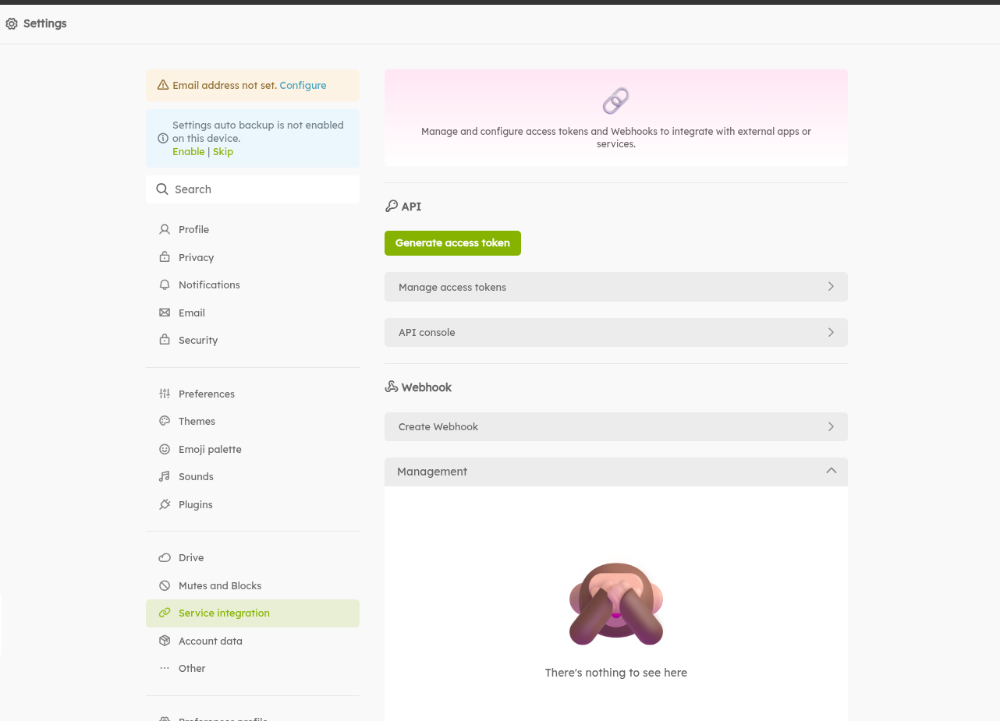
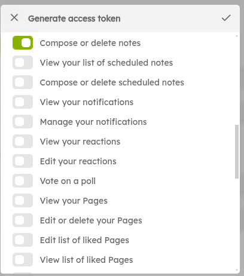

<!-- SERVICE:DETAILS -->

## Account Setup

Sign up for any Misskey based service. [Here are a few you can choose from today](https://misskey-hub.net/en/instances.html).

In Newer versions; the Access Token generation can be found in **Settings** -> **Service Integration** -> **Generate Access Token** (button).


**Note**: Other variations may provide **Generate access token** from the **API** menu item (it may vary depending on what version of misskey your chosen service is using).

While generating the token:

- Call it whatever you want
- At the bare minimum you need to grant the: **Compose or delete notes**<br/>
  

After you save your changes, you will be provided with the **Access Token** needed to work with Apprise.

## Syntax

Valid syntax is as follows:

- `misskey://{token}@{host}`
- `misskeys://{token}@{host}`

Simply use `misskey://` if accessing an insecure server and `misskeys://` if accessing a secure one (https). In most cases, you'll likely always be using `misskeys://`

## Parameter Breakdown

| Variable   | Required | Description                                                                                                                                                                                                                                                                                                                                                                                                                                                                                                                                                                                                                                                                                                                                                                                               |
| ---------- | -------- | --------------------------------------------------------------------------------------------------------------------------------------------------------------------------------------------------------------------------------------------------------------------------------------------------------------------------------------------------------------------------------------------------------------------------------------------------------------------------------------------------------------------------------------------------------------------------------------------------------------------------------------------------------------------------------------------------------------------------------------------------------------------------------------------------------- |
| token      | Yes      | The Access Token associated with the Application you created (in Misskey's Account Settings). Your token MUST have at the bare minimum `write:statuses` access. Additionally provide `write:media` if you intend to provide attachments.                                                                                                                                                                                                                                                                                                                                                                                                                                                                                                                                                                  |
| visibility | No       | The Misskey visibility you want to operate in. Possible values are:<br/>🔴 `public`: your note will be visible to all users and will show up on all timelines (home, local, social, global).<br/>Note: If your account is _silenced_, you cannot set your note visibility to public.<br/>🔴 `home`: Your note will be visible to all users, but will not show up on the local, social or global timeline for non-followers.<br/>🔴 `followers`: Your note will only be visible to those that are following you. The note will show up on all timelines of your followers.<br/>🔴 `specified`: Your note will only be visible to individually specified users. The note will show up on all timelines of the specified users. If you enable this option, your note won't be federated to remote instances. |

<!-- GLOBAL:SERVICE:PARAMS -->

## Examples

Create a Misskey note on the `misskey.sda1.net` server :

```bash
# Assuming our {hostname} is misskey.sda1.net
# Assuming our {token} is abcdefghijklmn
apprise -vv -t "Test Message Title" -b "Test Message Body" \
   "misskeys://misskey.sda1.net/abcdefghijklmn"
```

This example builds on the last but leverages the `visibility` option::

```bash
# Assuming our {hostname} is misskey.sda1.net
# Assuming our {token} is abcdefghijklmn
# Assuming a {visibility} of home
apprise -vv -t "Test Message Title" -b "Test Message Body" \
   "misskeys://misskey.sda1.net/abcdefghijklmn?visibility=home"
```

## Troubleshooting

1. `WARNING - Failed to send Misskey notification: Method not allowed., error=405.`
   - If the website is hosted as `http` (insecure) you must use `misskey://` when assembling your Apprise URL where as if the website is `https` (secure hosting) you would use `misskeys://`
1. `WARNING - Failed to send Misskey notification: error=403.`
   - Make sure that the API Token you generated has the **Compose or delete notes** security setting enabled. You may need to regenerate a new key that includes this permission, otherwise verify you provided the correct token in your Apprise URL.
