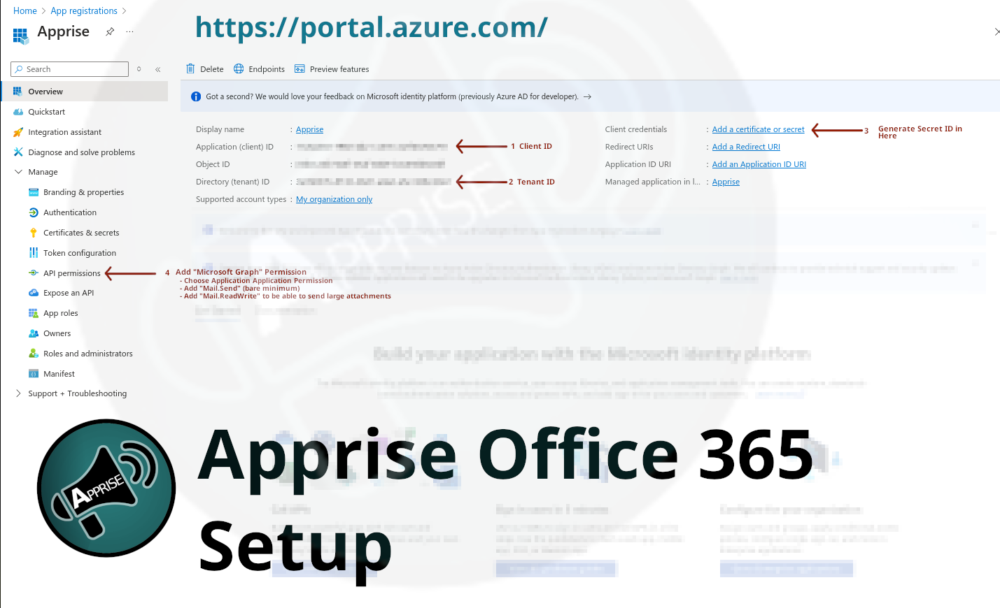

<!-- SERVICE:DETAILS -->

## Account Setup

This plugin uses the Microsoft Graph API. It supports **Personal Accounts** (Outlook.com, Hotmail, Live) and **Business Accounts** (Office 365).

Because Microsoft has disabled Basic Authentication (Username/Password), you must register an application in Azure to generate the credentials Apprise needs (Client ID, Secret, etc).

1. From the [**Azure Portal**](https://portal.azure.com/) go to **App Registrations** ([alt link](https://portal.azure.com/#view/Microsoft_AAD_RegisteredApps/ApplicationsListBlade))
   - Use the search bar at the top of the Azure Portal and type `App Registrations`.
   - If you still can't access anything, it's possible your organization restricts you from doing so. You may need to reach out to your administrator in order to proceed.<br/>
1. Click **Register an application**
   - Give it any name (e.g., "Apprise Notifications").
   - **Crucial:** Select **Accounts in any organizational directory and personal Microsoft accounts** (or "Personal Microsoft accounts only" if you are not in an org).
   - Click **Register**.
1. From here (the **Overview** panel) you can acquire both the Directory (`tenant`) ID and the Application (`client_id`) you will need.
1. To create your `client_secret` , go to **Certificates & secrets** -> **New client secret**.
   - The `client_secret` is an auto-generated string which may have `@` and/or `?` character(s) in it. You will need to encode these characters when pasting this into your Apprise URL. See the note section below for more details.
1. Now set permissions: **API permissions** -> **Add a permission**.
1. Click on **Microsoft Graph**.
1. Click on **Application Permissions** and search for **Mail.Send**; check the box and click "Add permissions".
   - **Important:** After adding, you must click **Grant admin consent** for the permissions to take effect.
1. Additionally, grant access to **Mail.ReadWrite** if you intend to send large attachments (> 3MB).
1. Additionally, grant access to **User.Read.All** if you want Apprise to automatically detect your "From" address name, or if you intend to use an Object ID as your `source`.
1. Now you're good to go. 🙂

## Syntax

Valid syntax is as follows:

- `o365://{source}/{tenant_id}/{client_id}/{client_secret}/`
- `o365://{source}/{tenant_id}/{client_id}/{client_secret}/{targets}`
- `azure://{source}/{tenant_id}/{client_id}/{client_secret}/`
- `azure://{source}/{tenant_id}/{client_id}/{client_secret}/{targets}`

## Parameter Breakdown

| Variable      | Required | Description                                                                                                                                    |
| ------------- | -------- | ---------------------------------------------------------------------------------------------------------------------------------------------- |
| source        | Yes      | The **Email Address** (or ObjectID) associated with the Azure Account you wish to send the email from.                                         |
| tenant_id     | Yes      | The **Tenant ID** (Directory ID) associated with your App Registration.                                                                        |
| client_id     | Yes      | The **Client ID** (Application ID) associated with your App Registration.                                                                      |
| client_secret | Yes      | The **Client Secret** you generated in the "Certificates & secrets" section.                                                                   |
| from          | No       | If you want the email _ReplyTo_ address to be something other than your own email address, you can specify it here.                            |
| to            | No       | Override the target email. By default, the email is sent to the address identified by the `source` (or the targets specified in the URL path). |

<!-- TEMPLATE:SERVICE-PARAMS -->

:::note

- If no `targets` are specified, then the notification is just sent to the address identified by `{account_email}`
- Unfortunately the `client_secret` contains a lot of characters that can drastically conflict with standard URL rules (and thus Apprise might have difficulty detecting your client secret). The `?` and `@` characters can get generated by Microsoft and will almost definitely cause you issues.
  - Consider encoding this `client secret` before putting it into your Apprise URL. Encoding the URL can be as simple as just pasting it into the form on [this website](https://www.url-encode-decode.com/).
  - You can also just manually escape these characters on your Apprise URL yourself manually ([explained here](https://github.com/caronc/apprise/wiki/Troubleshooting#special-characters-and-url-conflicts)). Simply swap all instances of: - `?` with `%3F` - `@` with `%40`
    :::

## Examples

Send a email notification to our your Office 365 account:

```bash
# Assuming our {tenant_id} is ab-cd-ef-gh
# Assuming our {account_email} is chuck.norris@roundhouse.kick
# Assuming our {client_id} is zz-yy-xx-ww
# Assuming our {client_secret} is rt/djd/jjd
apprise -vv -t "Test Message Title" -b "Test Message Body" \
   o365:///chuck.norris@roundhouse.kick/ab-cd-ef-gh/zz-yy-xx-ww/rt/djd/jjd
```
