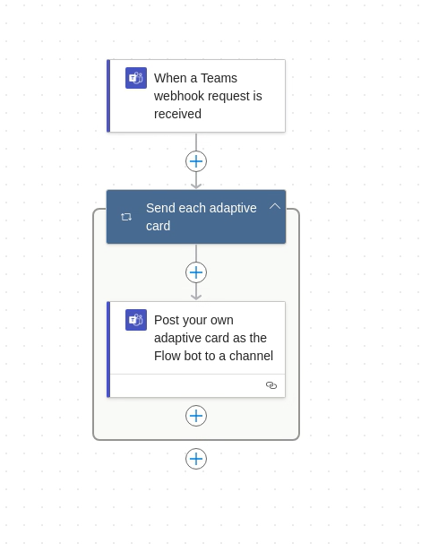

<!-- SERVICE:DETAILS -->

## Account Setup

Depending on where you want your notification to appear, you must create a workflow through the options. e.g. an MS Teams workflow might look like this:<br/>


Documentation for this can be found [here](https://learn.microsoft.com/en-us/power-automate/teams/send-a-message-in-teams)

When you've completed this, it will generate you a URL that looks like:

```text
https://prod-NO.LOCATION.logic.azure.com:443/workflows/WFID/triggers/manual/paths/invoke?api-version=2016-06-01&sp=%2Ftriggers%2Fmanual%2Frun&sv=1.0&sig=SIGNATURE
       |-------------------------------| |-|             |                                                                                                  |
                    |                     |          {workflow}                                                                                          {signature}
             host information {host}      |
                                         {port}

```

Yes... The URL is that big... but at the end of the day this effectively equates to:

- `workflows://{host}:{port}/{workflow}/{signature}`

:::tip
Apprise supports this URL _as-is_ too; you no longer need to parse the URL any further. However there is slightly more overhead (internally) if you do use it this way. Sometimes copy/paste is so much easier though!
:::

## Syntax

Valid syntax is as follows:

- `https://prod-site.logic.azure.com:443/workflows/{workflow}/triggers/manual/paths/invoke?api-version=2016-06-01&sp=%2Ftriggers%2Fmanual%2Frun&sv=1.0&sig={signature}`
- `workflows://{host}:{port}/{workflow}/{signature}`

## Parameter Breakdown

| Variable  | Required | Description                                                                                                                                                                                                                                                                                                 |
| --------- | -------- | ----------------------------------------------------------------------------------------------------------------------------------------------------------------------------------------------------------------------------------------------------------------------------------------------------------- |
| workflow  | Yes      | The Workflow Identifier provided in the Azure Webhook Link                                                                                                                                                                                                                                                  |
| signature | Yes      | The Signature Identifier provided in the Azure Webhook Link (`sig=`)                                                                                                                                                                                                                                        |
| wrap      | No       | Wrap body text in response.                                                                                                                                                                                                                                                                                 |
| ver       | No       | The Power Automate API Version to use; the default value is `2016-06-01`. This is also parsed using the keyword `api-version` that can be found on the Azure Webhook Link.                                                                                                                                  |
| template  | No       | provide a path to a template you would prefer to use instead of the Adaptive card chosen by Apprise. use double `{{token}}` curly braces to identify the tokens you wish to have swapped in the provided template prior to it's submission to the upstream service. (e.g `{{app_body}}` or `{{app_title}}`) |

<!-- TEMPLATE:SERVICE-PARAMS -->

## Examples

Send a Microsoft Teams notification:

```bash
# Assuming our {host} is prod-site.logic.azure.com
# Assuming our {port} is 443
# Assuming our {workflow} is T1JJ3T3L2@DEFK543
# Assuming our {signature} is TIiajkdnlazkcOXrIdevi7F
apprise -vv -t "Test Message Title" -b "Test Message Body" \
   workflows:///prod-site.logic.azure.com:443/T1JJ3T3L2@DEFK543/TIiajkdnlazkcOXrIdevi7F/
```

## Templating

### The `template` URL Argument

Define a `?template=` argument that points to a predefined JSON payload you wish to provide Workflow. Ideally you may wish to stick with the [AdaptiveCards](https://learn.microsoft.com/en-us/power-automate/create-adaptive-cards).

#### The Template Tokens

The `template=` you point to, can either be fully populate and ready to go as is (up to the MSTeams chat server), or you can dynamically populate it on the fly each time you call Apprise. You do this by using the double curly brace `{{` and `}}` to surround a keyword that you invent; here is an example:

```json
{
  "$schema": "http://adaptivecards.io/schemas/adaptive-card.json",
  "type": "AdaptiveCard",
  "version": "1.5",
  "body": [
    {
      "type": "TextBlock",
      "text": "{{app_title}}",
      "weight": "Bolder",
      "separator": true
    },
    {
      "type": "TextBlock",
      "text": "{{app_body}}",
      "wrap": true
    }
  ]
}
```

In the above example, we introduce several tokens... `app_id`, `app_title`, `target` and `whence`. There are a few entries that will ALWAYS be set and you can not over-ride them. They are:

- **app_id**: The Application identifier; usually set to `Apprise`, but developers of custom applications may choose to over-ride this and place their name here. this is how you acquire this value.
- **app_desc**: Similar the the Application Identifier, this is the Application Description. It's usually just a slightly more descriptive alternative to the _app_id_. This is usually set to `Apprise Notification` unless it has been over-ridden by a developer.
- **app_color**: A hex code that identifies a colour associate with a message. For instance, `info` type messages are generally blue where as `warning` ones are orange, etc.
- **app_type**: The message type itself; it may be `info`, `warning`, `success`, etc
- **app_title**: The actual title (`--title` or `-t` if from the command line) that was passed into the apprise notification when called.
- **app_body**: The actual body (`--body` or `-b` if from the command line) that was passed into the apprise notification when called.
- **app_image_url**: The image URL associated with the message type (`info`, `warning`, etc) if one exists and/or was not specified to be turned off from the URL (`image=no`)
- **app_url**: The URL associated with the Apprise instance (found in the **AppriseAsset()** object). Unless this has been over-ridden by a developer, it's value will be `https://github.com/caronc/apprise`.

Anything you invent outside of that is yours. So lets get back to the `target` and `whence` that was define. Template tokens can be dynamically set by using the colon `:` operator before any URL argument you identify. For example we can set these values on our Apprise URL like so:

- `workflows://credentials/?template=/path/to/template.json&:target=Chris&:whence=this%20afternoon`
- `workflows://credentials/?template=http://host/to/template.json&:target=Chris&:whence=this%20afternoon`

A notification like so:

```bash
# using colons, we can set our target and whence dynamically from the
# command line:
apprise -t "My Title goes in app_title" -b "This is placed into the app_body" \
   "workflows://credentials/?template=http://host/to/template.json&:target=Chris&:whence=this%20afternoon"
```

Would post to MSTeams (with respect to our template above):

```json
{
  "$schema": "http://adaptivecards.io/schemas/adaptive-card.json",
  "type": "AdaptiveCard",
  "version": "1.0",
  "body": [
    {
      "type": "TextBlock",
      "text": "{{app_title}}",
      "weight": "Bolder",
      "separator": true
    },
    {
      "type": "TextBlock",
      "text": "{{app_body}}",
      "wrap": true
    },
    {
      "type": "TextBlock",
      "text": "Hello {{ target }}, how are you {{ whence }}?",
      "wrap": true
    }
  ]
}
```

#### Additional Template Notes

- Tokens can have white space around them for readability if you like. Hence `{{ token }}` is no different then `{{token}}`.
- All tokens are escaped properly, so don't worry if your defined token has a double quote in it (`"`); it would be correctly escaped before it is sent upstream.
- Tokens ARE case sensitive, so `{{Token}}` NEEDS to be populated with a `:Token=` value on your URL.
- Tokens that are not matched correctly simply are not swapped and the {{keyword}} will remain as is in the message.
- Apprise always requires you to specify a `--body` (`-b`) at a very minimum which can be optionally referenced as `{{app_body}}` in your template. Even if you choose not to use this token, you must still pass in something (anything) just to satisfy this requirement and make use of the template calls.
